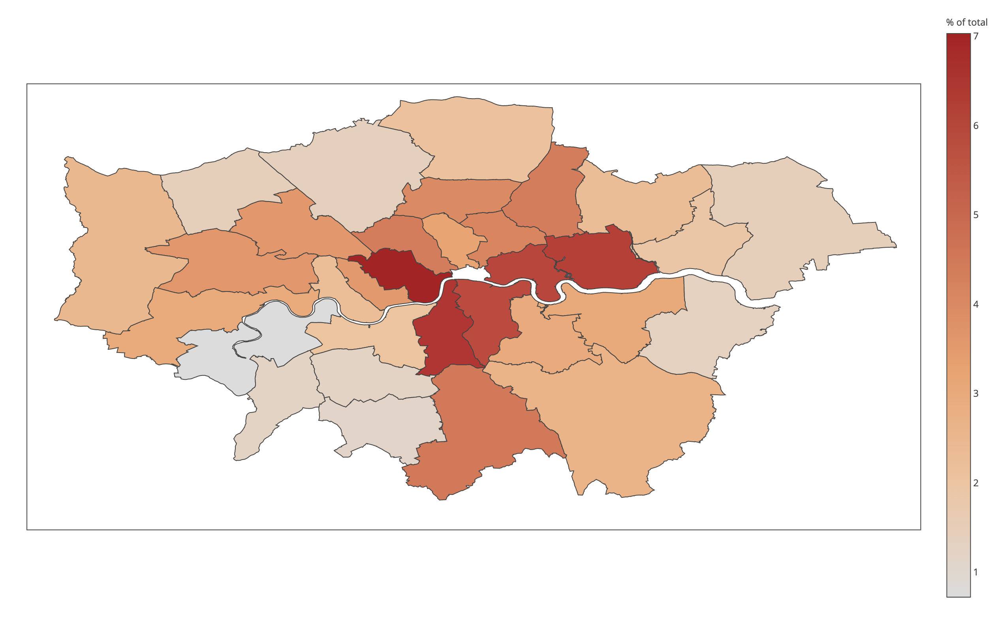

Source: BBC 

# Metropolitan Police Stop and Search Analysis (June 2017 - July 2020)

Stop and search is a divisive topic. Some view it as a necessary evil to help curb violent crime, while others see it as an inherently predatory and even racist practice. Seeking a deeper understanding of the topic, we acquired multiple datasets spanning from mid 2017 to mid 2020, and began to answer the most consequential questions. While statistics in and of themselves cannot provide absolute answers for how we ought to administer a just society, a firm understanding of the data surrounding a subject is an essential prerequisite for reasoned discussion. This analysis aspires to aid that understanding.

The data was acquired from the official UK Police repository: data.police.uk/data

### Percent distribution of all stop and search incidents by London borough from 2017 onwards

## This analysis set out to answer the following questions: 

### 1. How common is it for a search to be performed on a vehicle, but not the occupant/driver? 

### 2. How much more frequently are males searched compared to females?

### 3. Which age group undergoes the most searches?

### 4. What is the ethnicity of the citizens who undergo the most searches?

### 5. What is the ethnicity of the officers who perform the most searches? 

### 6. Which piece of legislation do officers most commonly invoke to justify a search? 

### 7. What do officers most commonly claim they are looking for to justify a search? 

### 8. What is the most common outcome of a search?

### 9. At which part of the day are most searches perfomed? 
